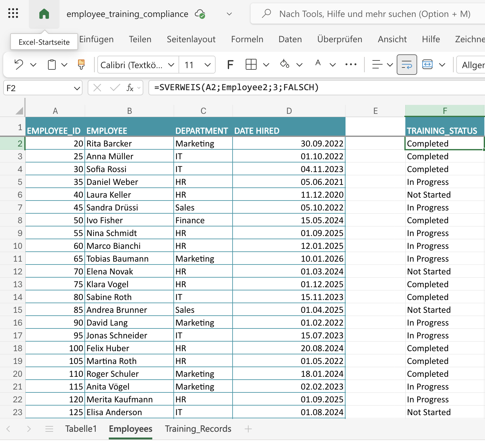
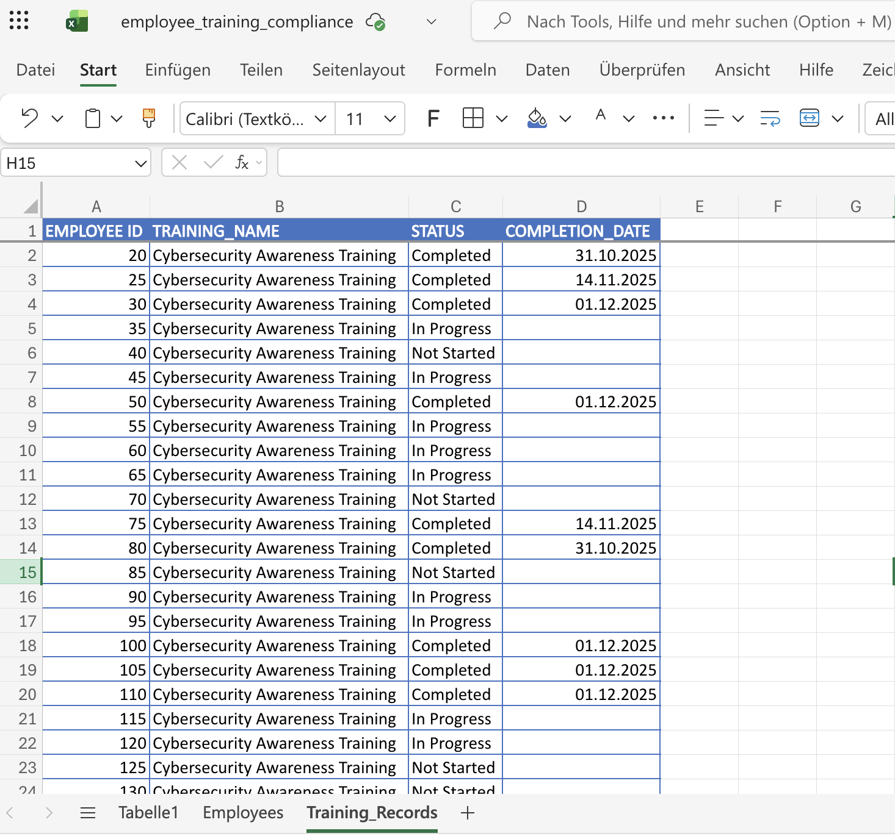
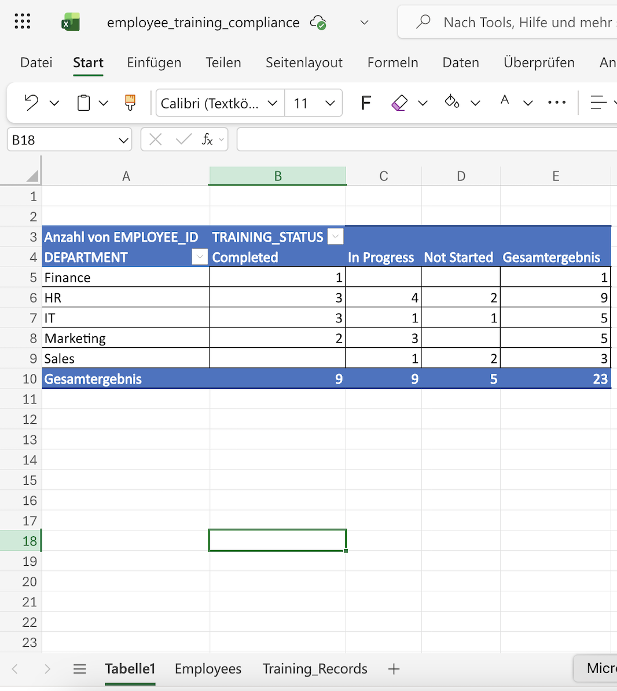

# Employee Training Compliance (Excel)

Excel-based HR compliance example demonstrating employee training tracking using **VLOOKUP** and **Pivot Tables**.

## Data structure
- **Employees** – employee list with ID, name, department, and hire date
- **Training_Records** – training completion data  
  - Training records table was renamed to **Employee2** and used as the lookup source
  - All employee names, IDs, and dates in this example are fictional and used solely for demonstration purposes.
    
## Goal
Demonstrate practical Excel skills for HR and compliance-related reporting.

## Excel logic
In the **Employees** sheet, training status is retrieved from the training records using **VLOOKUP** based on EMPLOYEE_ID.

## Key Excel features
- VLOOKUP to assign training status to employees
- Pivot Table showing training status distribution by department
- Employee count per training status (Completed / In Progress / Not Started)

## Screenshots

### Employee list

### Training records

### Training status by department (Pivot)

